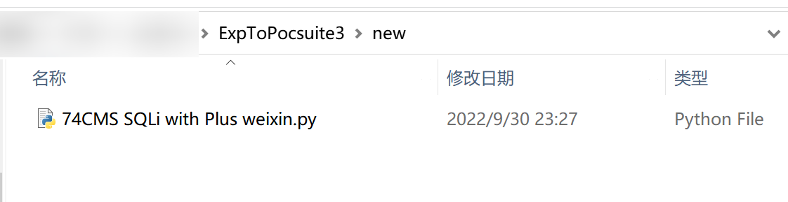

**作者：** 小狐狸FM

**版本：** v 0.1

**功能：** 将exp转换为pocsuite3格式

**介绍：**

```
1. goby导出的pocsuite脚本文件名与.json中的第一个参数Name相同
2. goby导出的pocsuite脚本末尾将会附上原先的goby脚本内容以便后续的手动修改
```

**缺点：**

```
1. 目前仅支持goby的json格式exp转换（之后可能会添加其他漏扫工具的脚本转换功能）
2. goby与pocsuite的网络空间搜索引擎（可能是我没有使用过）
```

**使用介绍：**

使用`-h`参数查看可用的参数

```
ExpToPocsuite3.py -h
```


`-g`设置指定的goby脚本目录位置，设置后将会读取该目录下所有的`.json`后缀文件（不包括其子目录）

`-p`设置导出的pocsuitet脚本目录位置

```
ExpToPocsuite3.py -g Template -p new
```




