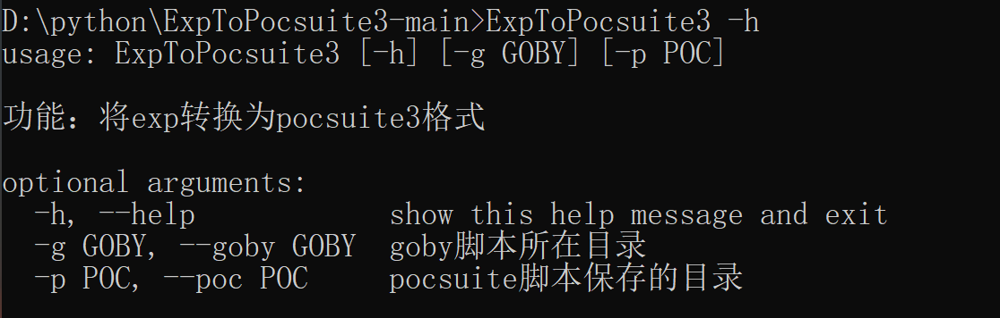
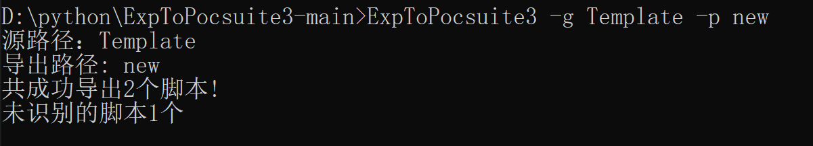
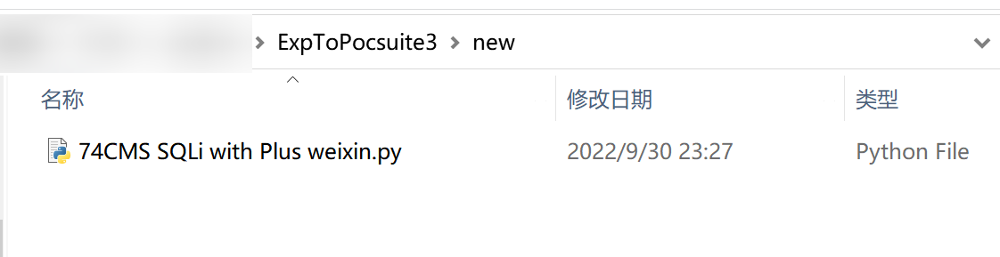

**作者：** 小狐狸FM

**功能：** 将exp转换为pocsuite3格式

**介绍：**

```
1. goby导出的pocsuite脚本文件名与json字符串中的第一个参数Name相同
2. goby导出的pocsuite脚本末尾将会附上原先的goby脚本内容以便后续的手动修改
3. goby的自定义exp脚本存储路径为/golib/exploits/user
```

**缺点：**

```
1. 目前仅支持goby的exp转换（之后可能会添加其他漏扫工具的脚本转换功能）
2. 若exp格式出现问题，需要自行调整
3. 转换时无法转换子目录下的脚本
4. 脚本无法完全替代手动调试，只能减轻一部分的工作量，请在批量转换后自行调试
5. 模板使用的pocsuite3版本为1.9.6，低版本的pocsuite3不一定支持
```

**更新：**

```
1. 代码不开源
2. 修复0.1测试版本中部分poc转换报错的问题
```


**使用介绍：**

默认不填写参数或使用`-h`参数可查看当前可用的参数

```
ExpToPocsuite3 -h
```



`-g`设置指定的goby脚本目录位置，设置后将会读取该目录下所有的`.json`后缀文件（不包括其子目录）

`-p`设置导出的pocsuitet脚本目录位置

```
ExpToPocsuite3 -g Template -p new
```






